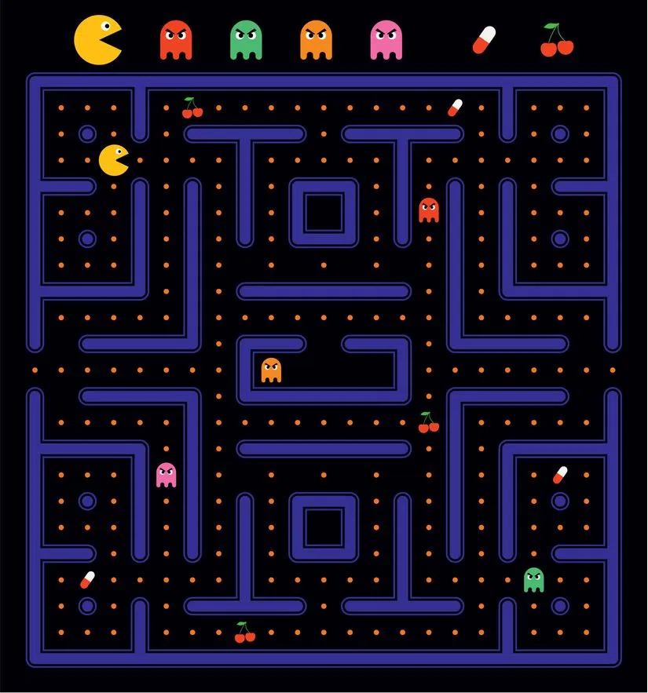

# PacMan Game (C++)

 

 

# Instrucciones (Spanish Version)  (English Version Below)
Instrucciones para el uso del programa del Comecocos: 

1) Los archivos de texto y los archivos C, fueron programados en Windows con el pac de notas, por tanto se recomienda quitar ajuste de lineas y ajustar zoom
	si se ejecuta desde ubuntu, ya que el archivo estara mas ordenado.

2) Se recomienda reducir el zoom de la terminal hasta el minimo que permita leer con comodidad si se ejecuta desde Ubuntu, ya que asi no habra que mover la barra arriba y abajo 
	para ver todo lo necesario cada turno.

3) En el compilador/terminal se debe poner lo siguiente: (una vez nos encontremos en la carpeta de comecocos)

				$ gcc comecocos.c -o exe
				$ ./exe informe_partida.txt tablero_inicial.txt
 
	Ya que son los archivos que por defecto se han creado para que el programa funcione correctamente. 
	
	*Para la opcion guardar tablero, dentro de la partida, se podrá usar el archivo guardar_tablero.txt que tambien se encuentra en esta carpeta, o en su defecto cualquier otro nombre que quiera el usuario.
	
	
4) Mencionadas estas aclaraciones, espero que disfrute del juego del comecocos!

 

# Instructions (English Version)

1) The text files and C files were programmed on Windows with Notepad, therefore it is recommended to remove line wrapping and adjust zoom if running from Ubuntu, as the file will be more organized.

2) It is recommended to reduce the terminal zoom to the minimum comfortable level if running from Ubuntu, so there is no need to scroll up and down to see everything necessary each turn.

3) In the compiler/terminal, the following should be entered: (once we are in the pacman folder)

				$ gcc comecocos.c -o exe
				$ ./exe informe_partida.txt tablero_inicial.txt

    Since these are the files that have been created by default for the program to function correctly.

    *For the option to save the board within the game, the file guardar_tablero.txt can be used, which is also located in this folder, or alternatively any other name the user prefers.

4) With these clarifications mentioned, I hope you enjoy the game of Pac-Man!
